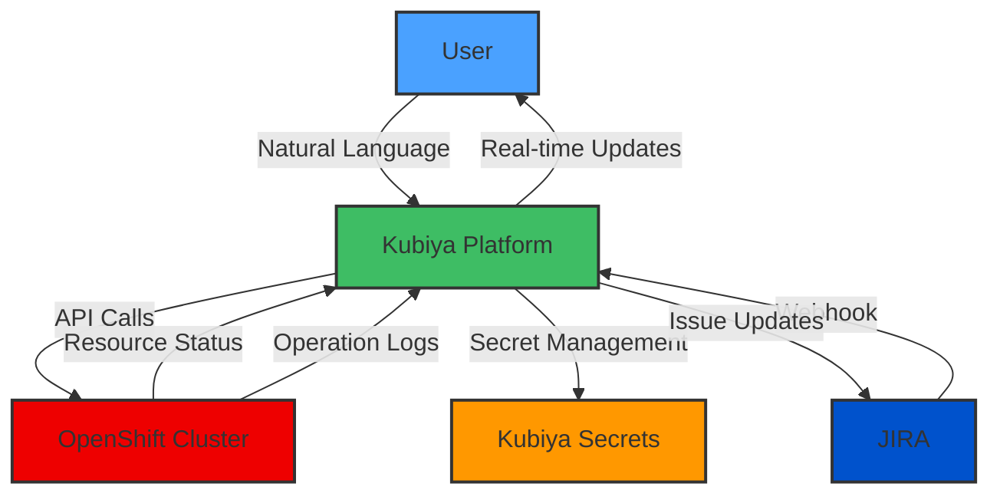

# 🤖 OpenShift Conversational Proxy

Transform your OpenShift cluster operations with an AI-powered conversational interface. Execute, monitor, and manage OpenShift resources through natural language interactions while maintaining security and control.

## 🌟 Features

- 🎯 **Natural Language Control**: Execute OpenShift operations using conversational commands
- 📊 **Resource Management**: Create and manage projects, applications, and resources
- 🔄 **Cluster Operations**: Handle deployments, services, and route management
- 🔐 **Secure Authentication**: Token-based authentication with secret management
- 📝 **Resource Monitoring**: Track resource status and health
- ⏱️ **Operation Control**: Handle long-running operations with proper status tracking
- 🎛️ **Flexible Configuration**: Support for various OpenShift resources and operations
- 👥 **Access Control**: Role-based access through Kubiya groups
- 🔄 **JIRA Integration**: Automated processing of JIRA issues and events

## 🏗 Architecture



## 📋 Requirements

- OpenShift cluster with API access enabled
- OpenShift user credentials with appropriate permissions
- Kubiya platform access
- `KUBIYA_API_KEY` environment variable set
- JIRA instance with webhook configuration
- Proper JIRA permissions and access setup

## 🚀 Quick Start

1. **Configure Variables**:
```hcl
module "openshift_proxy" {
  source = "kubiya-terraform/kubiya"

  # OpenShift Configuration
  openshift_url      = "https://openshift.example.com"
  openshift_username = "admin"
  openshift_password = var.openshift_password  # Pass securely

  # Runner Configuration
  kubiya_runner = "kubiya-hosted"
  
  # Access Control
  name = "openshift-expert"
  integrations = ["slack"]
  allowed_groups = ["Admins", "Users"]
}

# Configure Webhook for JIRA Events
resource "kubiya_webhook" "jira_webhook" {
  filter = ""
  name   = "${module.openshift_proxy.name}-jira-webhook"
  source = "JIRA"
  prompt = <<-EOT
    Title: {{event.issue.summary}}
    Body: {{event.issue.description}}
  EOT
  agent       = module.openshift_proxy.name
  destination = "social"
}
```

2. **Set Environment Variables**:
```bash
export KUBIYA_API_KEY="your-api-key"
```

3. **Deploy**:
```bash
terraform init
terraform apply
```

## 💬 Example Interactions

```
User: "Create a new project called my-app"
Assistant: "I'll help you create a new OpenShift project called my-app. Status: Creating..."

User: "Deploy an application from image"
Assistant: "I'll help you deploy an application. Please provide:
1. The image name
2. The target project
3. Optional: resource limits"

User: "List all projects"
Assistant: "Here are your OpenShift projects:
1. my-app
2. default
3. openshift-monitoring
..."
```

## 📝 Configuration Reference

### Required Variables

| Name | Description | Type | Default |
|------|-------------|------|---------|
| `openshift_url` | OpenShift cluster URL | `string` | - |
| `openshift_password` | OpenShift password | `string` | - |

### Optional Variables

| Name | Description | Type | Default |
|------|-------------|------|---------|
| `openshift_username` | OpenShift username | `string` | `""` |
| `kubiya_runner` | Infrastructure runner | `string` | - |
| `name` | Assistant name | `string` | `"OpenShift Expert"` |
| `integrations` | Available integrations | `list(string)` | `["slack"]` |
| `groups` | Allowed groups | `list(string)` | `["Admins", "Users"]` |

### Webhook Configuration

| Name | Description | Type | Default |
|------|-------------|------|---------|
| `filter` | JIRA event filter pattern | `string` | `""` |
| `source` | Event source type | `string` | `"JIRA"` |
| `destination` | Webhook destination | `string` | `"social"` |

## 🔒 Security Features

1. **Credential Management**:
   - Secure storage in Kubiya's secret management
   - Environment variable-based configuration
   - Access control through Kubiya groups

2. **Access Controls**:
   - Role-based access control
   - Integration-specific permissions
   - Audit logging of all operations

3. **Operation Security**:
   - Resource quotas and limits
   - Namespace isolation
   - Controlled access to cluster resources

4. **Webhook Security**:
   - JIRA event filtering
   - Secure webhook endpoints
   - Authenticated event processing

## 🔍 Troubleshooting

Common issues and solutions:

1. **Connection Issues**:
   ```
   Error: Failed to connect to OpenShift cluster
   Solution: Verify OpenShift URL and credential permissions
   ```

2. **Authentication Errors**:
   ```
   Error: Invalid credentials
   Solution: Check OpenShift username and password configuration
   ```

3. **Resource Access Issues**:
   ```
   Error: Insufficient permissions
   Solution: Verify user roles and permissions in OpenShift
   ```

4. **Webhook Issues**:
   ```
   Error: JIRA webhook event processing failed
   Solution: Verify JIRA webhook configuration and event payload format
   ```

## 📚 Additional Resources

- [OpenShift Documentation](https://docs.openshift.com)
- [Kubiya Documentation](https://docs.kubiya.ai)
- [Security Best Practices](https://docs.kubiya.ai/security)
- [JIRA Integration Guide](https://docs.kubiya.ai/jira-integration)

## 🤝 Contributing

We welcome contributions! Please feel free to submit issues, feature requests, or pull requests.

## 📄 License

This module is released under the MIT License.

```
MIT License

Copyright (c) 2024 Kubiya.ai

Permission is hereby granted, free of charge, to any person obtaining a copy
of this software and associated documentation files (the "Software"), to deal
in the Software without restriction, including without limitation the rights
to use, copy, modify, merge, publish, distribute, sublicense, and/or sell
copies of the Software, and to permit persons to whom the Software is
furnished to do so, subject to the following conditions:

The above copyright notice and this permission notice shall be included in all
copies or substantial portions of the Software.

THE SOFTWARE IS PROVIDED "AS IS", WITHOUT WARRANTY OF ANY KIND, EXPRESS OR
IMPLIED, INCLUDING BUT NOT LIMITED TO THE WARRANTIES OF MERCHANTABILITY,
FITNESS FOR A PARTICULAR PURPOSE AND NONINFRINGEMENT. IN NO EVENT SHALL THE
AUTHORS OR COPYRIGHT HOLDERS BE LIABLE FOR ANY CLAIM, DAMAGES OR OTHER
LIABILITY, WHETHER IN AN ACTION OF CONTRACT, TORT OR OTHERWISE, ARISING FROM,
OUT OF OR IN CONNECTION WITH THE SOFTWARE OR THE USE OR OTHER DEALINGS IN THE
SOFTWARE.
```

---

Need help? Join our [Community Slack](https://slack.kubiya.ai) or [contact support](mailto:support@kubiya.ai).

---

_Built with ❤️ by [Kubiya.ai](https://kubiya.ai)_
